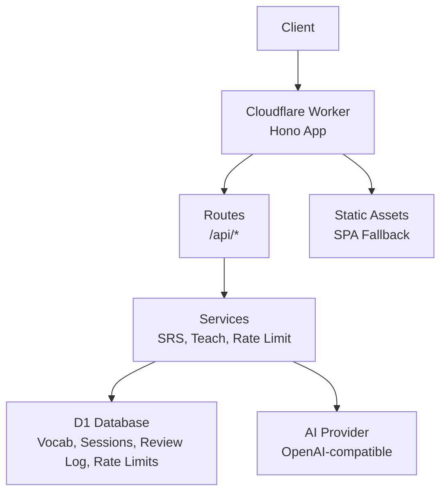
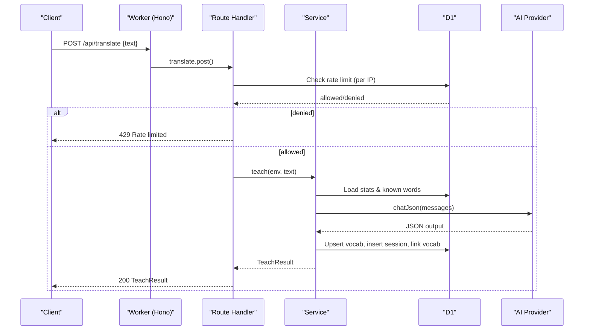
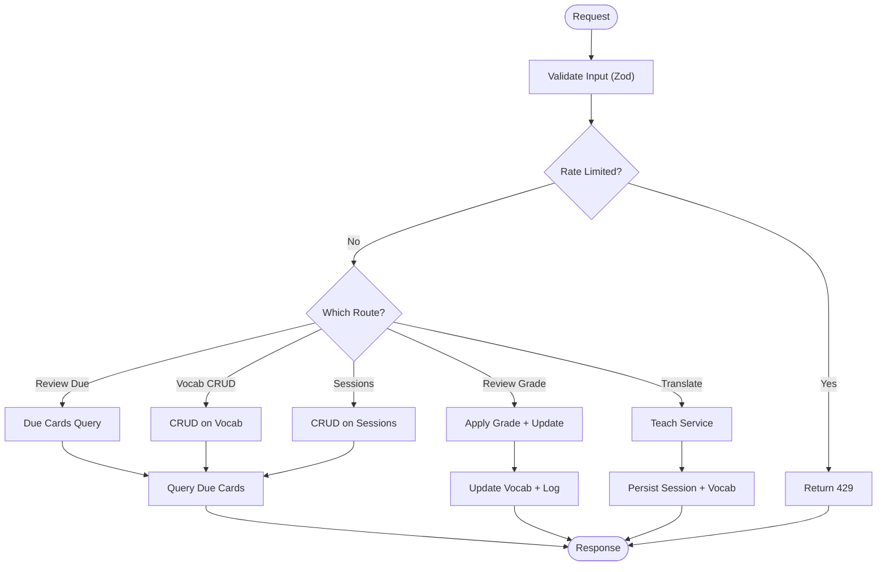
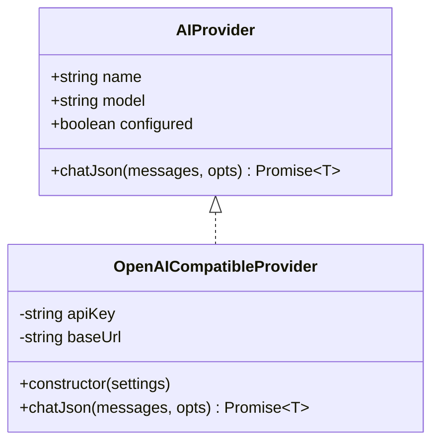
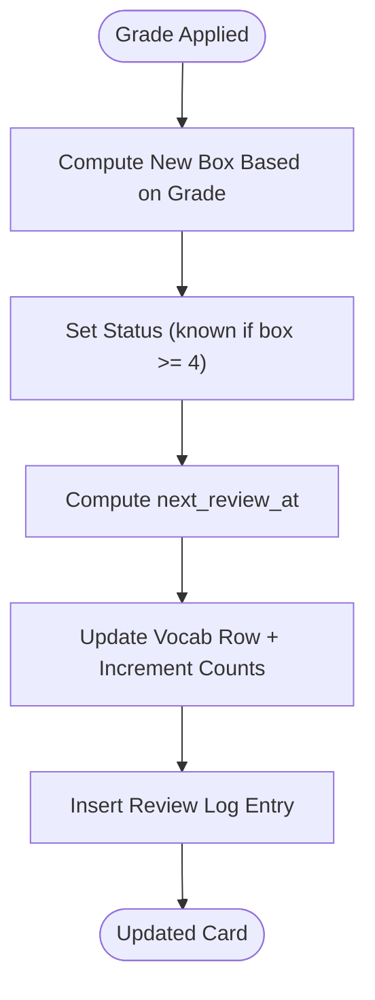
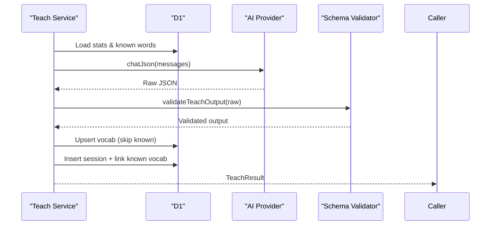
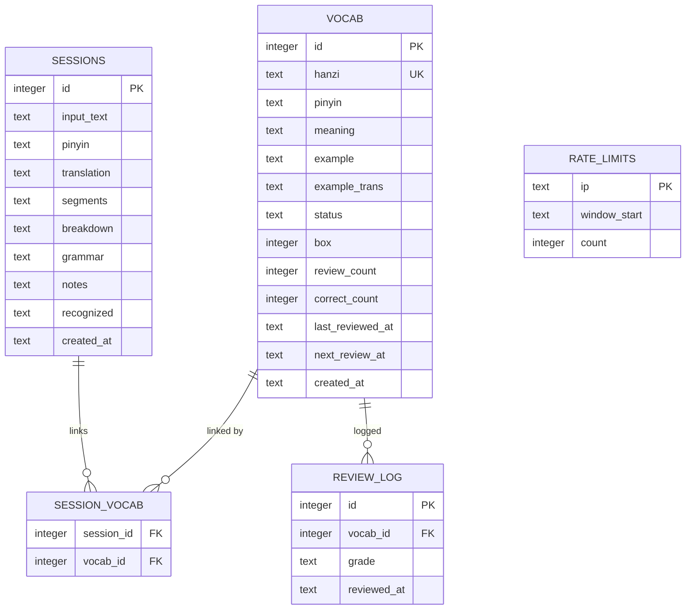
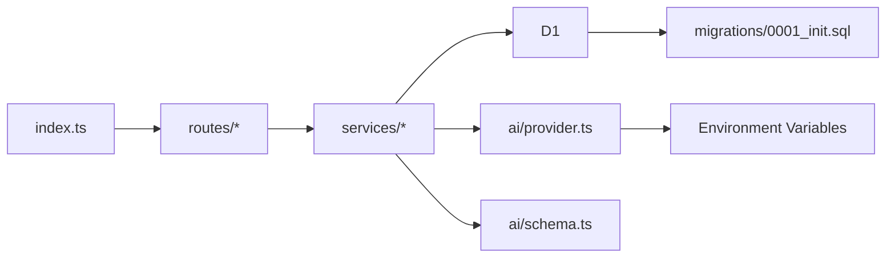

# Zhong Bidirectional Teaching System

<cite>
**Referenced Files in This Document**
- [README.md](file://apps/cloud/README.md)
- [index.ts](file://apps/cloud/src/index.ts)
- [package.json](file://apps/cloud/package.json)
- [wrangler.toml](file://apps/cloud/wrangler.toml)
- [0001_init.sql](file://apps/cloud/migrations/0001_init.sql)
- [provider.ts](file://apps/cloud/src/ai/provider.ts)
- [schema.ts](file://apps/cloud/src/ai/schema.ts)
- [types.ts](file://apps/cloud/src/ai/types.ts)
- [db.ts](file://apps/cloud/src/db.ts)
- [srs.ts](file://apps/cloud/src/services/srs.ts)
- [teach.ts](file://apps/cloud/src/services/teach.ts)
- [rate-limit.ts](file://apps/cloud/src/services/rate-limit.ts)
- [translate.ts](file://apps/cloud/src/routes/translate.ts)
- [vocab.ts](file://apps/cloud/src/routes/vocab.ts)
- [review.ts](file://apps/cloud/src/routes/review.ts)
- [sessions.ts](file://apps/cloud/src/routes/sessions.ts)
</cite>

## Table of Contents
1. [Introduction](#introduction)
2. [Project Structure](#project-structure)
3. [Core Components](#core-components)
4. [Architecture Overview](#architecture-overview)
5. [Detailed Component Analysis](#detailed-component-analysis)
6. [Dependency Analysis](#dependency-analysis)
7. [Performance Considerations](#performance-considerations)
8. [Troubleshooting Guide](#troubleshooting-guide)
9. [Conclusion](#conclusion)

## Introduction
Zhong is a Cloudflare Worker + D1 application that serves as a Chinese learning companion. It provides:
- A bidirectional teaching API that translates and explains text, breaking it into segments, grammar points, vocabulary, and notes.
- A spaced repetition system (SRS) for vocabulary review with due-card scheduling and grading.
- Session management to persist teaching sessions and their associated vocabulary.
- Rate limiting to protect the AI provider budget.
- A static web UI served from the same worker.

The system runs on Cloudflare Workers using Hono for routing, Zod for validation, and D1 (SQLite) for persistence. AI providers are abstracted behind an OpenAI-compatible interface, defaulting to DeepSeek but supporting OpenAI or any compatible endpoint via configuration.

**Section sources**
- [README.md:1-35](file://apps/cloud/README.md#L1-L35)
- [wrangler.toml:1-34](file://apps/cloud/wrangler.toml#L1-L34)

## Project Structure
At a high level, the project is organized by feature:
- src/index.ts: Application entrypoint; registers routes, CORS, health check, and error handling.
- src/routes: HTTP endpoints grouped by domain (translate, vocab, review, sessions).
- src/services: Business logic (SRS, rate limiting, teaching workflow).
- src/ai: Provider abstraction and schema definitions for model outputs.
- src/db.ts: Type definitions for database rows.
- migrations: D1 schema migrations.
- public: Static assets for the SPA frontend.

**Diagram sources**
- [index.ts:1-40](file://apps/cloud/src/index.ts#L1-L40)
- [wrangler.toml:1-34](file://apps/cloud/wrangler.toml#L1-L34)

**Section sources**
- [index.ts:1-40](file://apps/cloud/src/index.ts#L1-L40)
- [package.json:1-25](file://apps/cloud/package.json#L1-L25)
- [wrangler.toml:1-34](file://apps/cloud/wrangler.toml#L1-L34)

## Core Components
- Router and middleware: Hono app with CORS, global error handler, and route registration.
- AI provider abstraction: Configurable provider (DeepSeek/OpenAI/OpenAI-compatible) with JSON response parsing and error mapping.
- SRS engine: Leitner-style intervals, due card selection, grade application, and statistics.
- Teaching service: Builds prompts based on student level and known words, calls AI, validates output, persists sessions and vocabulary, and links recognized words.
- Rate limiter: Per-IP hourly limit stored in D1 with opportunistic cleanup.
- Data layer: D1-backed tables for vocab, sessions, session_vocab, review_log, and rate_limits.

**Section sources**
- [index.ts:1-40](file://apps/cloud/src/index.ts#L1-L40)
- [provider.ts:1-110](file://apps/cloud/src/ai/provider.ts#L1-L110)
- [srs.ts:1-96](file://apps/cloud/src/services/srs.ts#L1-L96)
- [teach.ts:1-198](file://apps/cloud/src/services/teach.ts#L1-L198)
- [rate-limit.ts:1-38](file://apps/cloud/src/services/rate-limit.ts#L1-L38)
- [0001_init.sql:1-54](file://apps/cloud/migrations/0001_init.sql#L1-L54)

## Architecture Overview
The system exposes REST-like endpoints under /api. Requests are routed to handlers that validate inputs, enforce rate limits, interact with D1, and optionally call the AI provider. Responses are typed and validated using Zod schemas.

**Diagram sources**
- [translate.ts:1-41](file://apps/cloud/src/routes/translate.ts#L1-L41)
- [teach.ts:139-198](file://apps/cloud/src/services/teach.ts#L139-L198)
- [provider.ts:62-104](file://apps/cloud/src/ai/provider.ts#L62-L104)
- [rate-limit.ts:8-37](file://apps/cloud/src/services/rate-limit.ts#L8-L37)

## Detailed Component Analysis

### API Layer (Routes)
- Health: Returns provider status and SRS stats.
- Translate: Validates input, enforces per-IP rate limit, invokes teaching pipeline, returns structured result.
- Vocab: List with filtering/search, update fields, delete word.
- Review: Fetch due cards, apply grades, return updated card and remaining due count.
- Sessions: List recent sessions, fetch session details with linked vocab, delete session.

**Diagram sources**
- [translate.ts:12-32](file://apps/cloud/src/routes/translate.ts#L12-L32)
- [review.ts:9-27](file://apps/cloud/src/routes/review.ts#L9-L27)
- [vocab.ts:7-73](file://apps/cloud/src/routes/vocab.ts#L7-L73)
- [sessions.ts:18-53](file://apps/cloud/src/routes/sessions.ts#L18-L53)
- [rate-limit.ts:8-37](file://apps/cloud/src/services/rate-limit.ts#L8-L37)

**Section sources**
- [index.ts:13-27](file://apps/cloud/src/index.ts#L13-L27)
- [translate.ts:1-41](file://apps/cloud/src/routes/translate.ts#L1-L41)
- [vocab.ts:1-77](file://apps/cloud/src/routes/vocab.ts#L1-L77)
- [review.ts:1-30](file://apps/cloud/src/routes/review.ts#L1-L30)
- [sessions.ts:1-56](file://apps/cloud/src/routes/sessions.ts#L1-L56)

### AI Provider Abstraction
- Supports multiple providers via environment variables.
- Uses an OpenAI-compatible endpoint contract for chat completions with JSON responses.
- Normalizes errors for common cases (auth, quota, rate limit).
- Exposes a simple interface for services to request structured JSON.

**Diagram sources**
- [types.ts:1-15](file://apps/cloud/src/ai/types.ts#L1-L15)
- [provider.ts:46-109](file://apps/cloud/src/ai/provider.ts#L46-L109)

**Section sources**
- [provider.ts:13-39](file://apps/cloud/src/ai/provider.ts#L13-L39)
- [provider.ts:62-104](file://apps/cloud/src/ai/provider.ts#L62-L104)
- [types.ts:1-15](file://apps/cloud/src/ai/types.ts#L1-L15)

### Spaced Repetition System (SRS)
- Implements a Leitner-style box progression with fixed intervals.
- Grades map to box movement and status transitions (new/learning/known).
- Due cards are selected by next_review_at ordering and null priority.
- Statistics aggregate totals, unseen, known, due counts, plus daily activity metrics.

**Diagram sources**
- [srs.ts:10-42](file://apps/cloud/src/services/srs.ts#L10-L42)

**Section sources**
- [srs.ts:1-96](file://apps/cloud/src/services/srs.ts#L1-L96)

### Teaching Pipeline
- Builds a prompt tailored to the student’s level and known vocabulary.
- Calls the AI provider to get structured output (translation, pinyin, segments, breakdown, grammar, notes, vocab).
- Validates the output against a strict schema.
- Persists new vocabulary items, records the session, and links previously known words.

**Diagram sources**
- [teach.ts:49-71](file://apps/cloud/src/services/teach.ts#L49-L71)
- [teach.ts:139-198](file://apps/cloud/src/services/teach.ts#L139-L198)
- [schema.ts:29-54](file://apps/cloud/src/ai/schema.ts#L29-L54)

**Section sources**
- [teach.ts:1-198](file://apps/cloud/src/services/teach.ts#L1-L198)
- [schema.ts:1-57](file://apps/cloud/src/ai/schema.ts#L1-L57)

### Rate Limiting
- Tracks requests per IP within a rolling hour window.
- Blocks when threshold exceeded; opportunistically prunes old entries.
- Protects AI provider quotas and prevents accidental loops.

**Section sources**
- [rate-limit.ts:1-38](file://apps/cloud/src/services/rate-limit.ts#L1-L38)

### Data Model
Key entities and relationships:
- vocab: Stores words with SRS state and metadata.
- sessions: Stores teaching sessions with parsed content.
- session_vocab: Links sessions to vocab items.
- review_log: Records each review event.
- rate_limits: Tracks per-IP usage windows.

**Diagram sources**
- [0001_init.sql:1-54](file://apps/cloud/migrations/0001_init.sql#L1-L54)

**Section sources**
- [0001_init.sql:1-54](file://apps/cloud/migrations/0001_init.sql#L1-L54)
- [db.ts:1-16](file://apps/cloud/src/db.ts#L1-L16)

## Dependency Analysis
- index.ts depends on routes and services; wires up CORS, health, error handling.
- Routes depend on services for business logic and on schema for validation.
- Services depend on D1 and AI provider abstraction.
- AI provider depends on environment configuration and network I/O.
- Migrations define the data model used across services.

**Diagram sources**
- [index.ts:1-40](file://apps/cloud/src/index.ts#L1-L40)
- [provider.ts:1-110](file://apps/cloud/src/ai/provider.ts#L1-L110)
- [schema.ts:1-57](file://apps/cloud/src/ai/schema.ts#L1-L57)
- [0001_init.sql:1-54](file://apps/cloud/migrations/0001_init.sql#L1-L54)

**Section sources**
- [index.ts:1-40](file://apps/cloud/src/index.ts#L1-L40)
- [provider.ts:1-110](file://apps/cloud/src/ai/provider.ts#L1-L110)
- [schema.ts:1-57](file://apps/cloud/src/ai/schema.ts#L1-L57)
- [0001_init.sql:1-54](file://apps/cloud/migrations/0001_init.sql#L1-L54)

## Performance Considerations
- Batched writes: SRS updates use db.batch to minimize round-trips when updating vocab and logging reviews.
- Efficient queries: Due cards query leverages indexes on next_review_at and created_at to optimize ordering and filtering.
- Rate limiting: Prevents excessive AI calls; includes periodic cleanup to keep rate_limits table small.
- Prompt context: Known words and student level reduce unnecessary explanations and token usage.
- Timeout protection: Teaching uses an AbortSignal timeout to avoid long-running requests.

[No sources needed since this section provides general guidance]

## Troubleshooting Guide
Common issues and resolutions:
- AI provider not configured: The translate route returns a 503 with guidance on which secret to set. Ensure the appropriate API key and base URL are configured via Wrangler secrets/vars.
- Invalid model output: Validation errors indicate the model did not conform to the expected schema; adjust prompts or model settings.
- Rate limit exceeded: Requests blocked with 429; wait for the next hour window or reduce request frequency.
- Word not found: Updates/deletes return 404 when the ID does not exist; verify IDs from list endpoints.
- Empty input: Teaching requires non-empty text; ensure client sends valid payloads.

Operational tips:
- Use /api/health to verify provider configuration and current stats.
- Monitor review logs and due counts to assess SRS effectiveness.
- Keep migrations applied before deploying schema changes.

**Section sources**
- [translate.ts:12-32](file://apps/cloud/src/routes/translate.ts#L12-L32)
- [index.ts:29-37](file://apps/cloud/src/index.ts#L29-L37)
- [rate-limit.ts:8-37](file://apps/cloud/src/services/rate-limit.ts#L8-L37)
- [vocab.ts:32-73](file://apps/cloud/src/routes/vocab.ts#L32-L73)
- [sessions.ts:30-53](file://apps/cloud/src/routes/sessions.ts#L30-L53)

## Conclusion
Zhong provides a robust, extensible foundation for Chinese language learning with bidirectional teaching, spaced repetition, and session tracking. Its modular design separates concerns across routing, services, and data layers, while the AI provider abstraction enables easy switching between models. With built-in rate limiting and validation, it balances usability with resource efficiency. The D1 schema supports scalable growth, and the architecture aligns well with Cloudflare’s serverless runtime.

[No sources needed since this section summarizes without analyzing specific files]