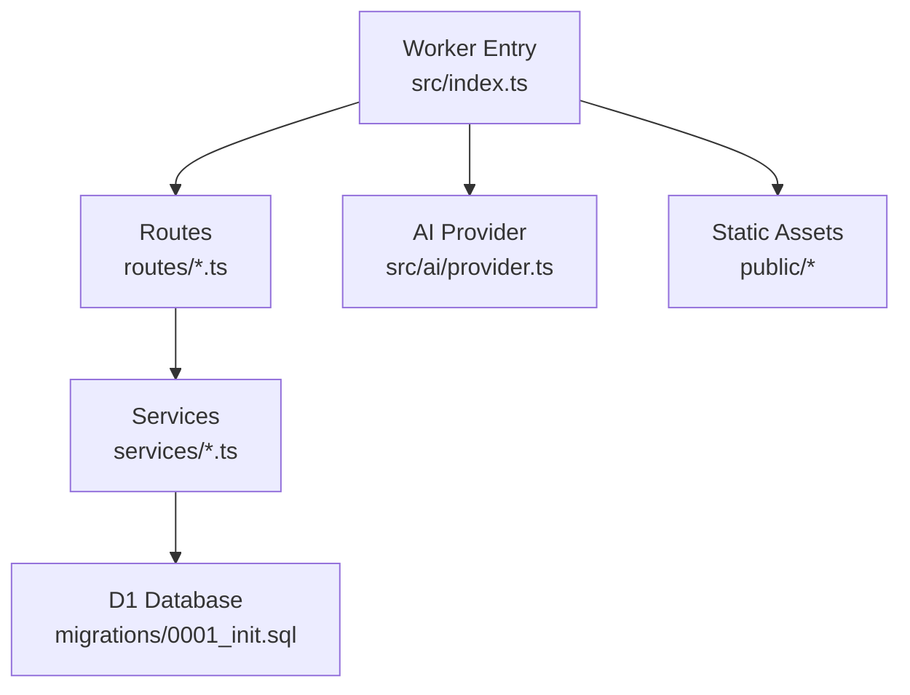
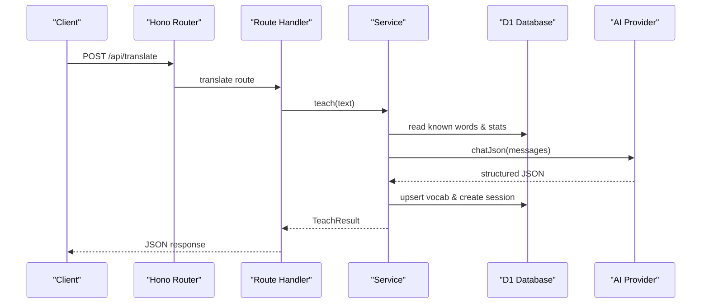
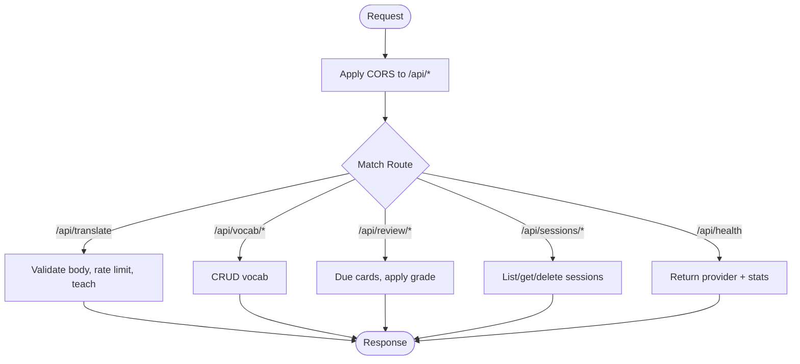
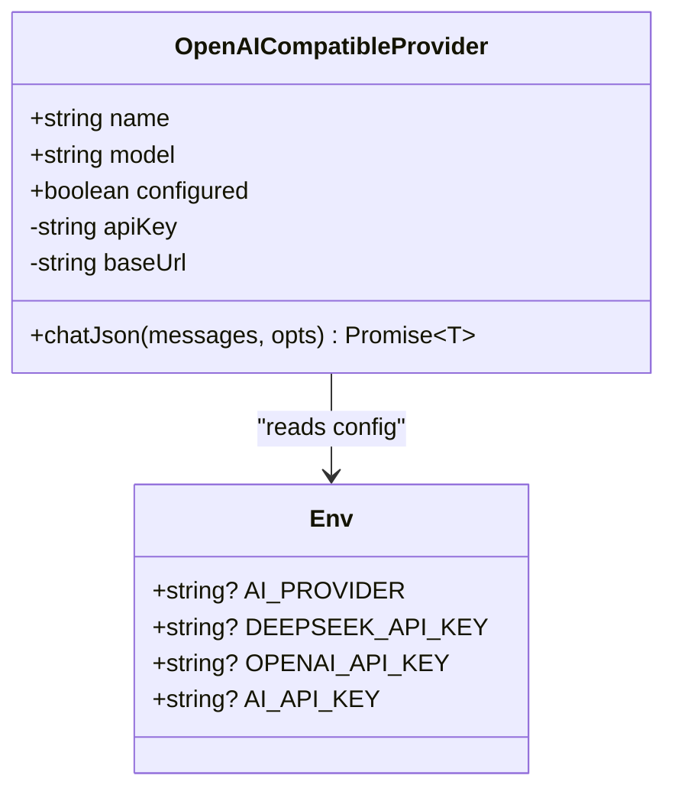
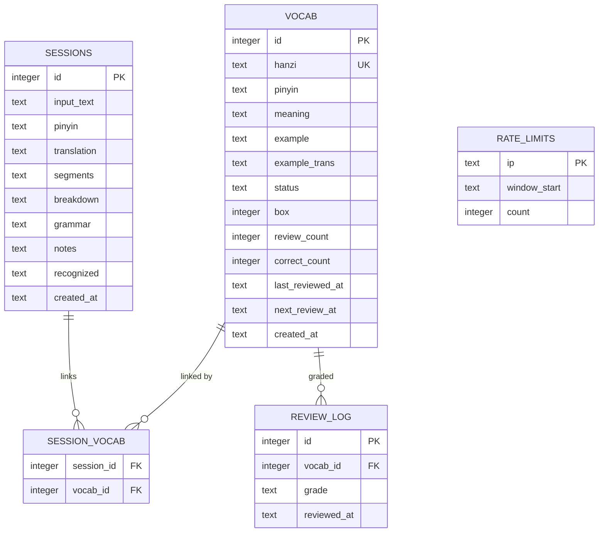
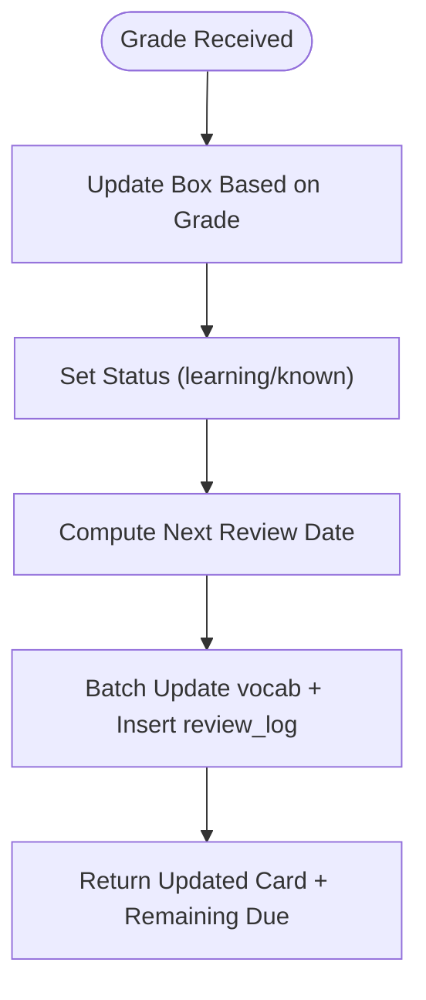
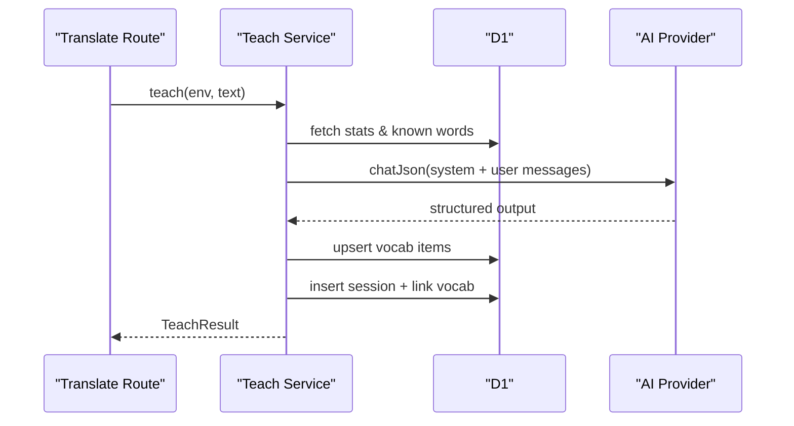
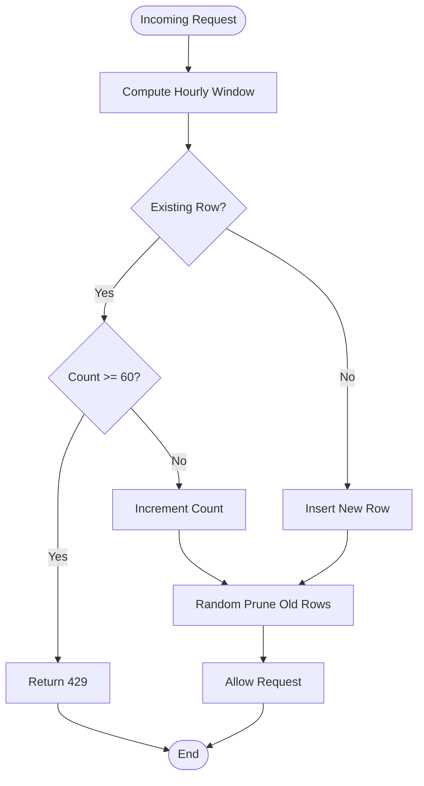
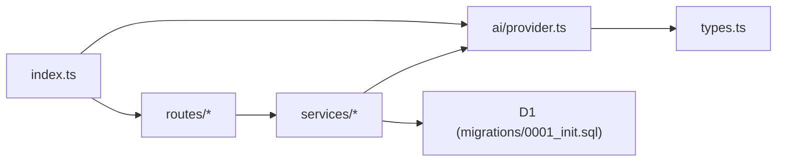

# Zhong Chinese Learning Companion

<cite>
**Referenced Files in This Document**
- [README.md](file://apps/cloud/README.md)
- [package.json](file://apps/cloud/package.json)
- [wrangler.toml](file://apps/cloud/wrangler.toml)
- [index.ts](file://apps/cloud/src/index.ts)
- [types.ts](file://apps/cloud/src/types.ts)
- [db.ts](file://apps/cloud/src/db.ts)
- [provider.ts](file://apps/cloud/src/ai/provider.ts)
- [schema.ts](file://apps/cloud/src/ai/schema.ts)
- [vocab.ts](file://apps/cloud/src/routes/vocab.ts)
- [sessions.ts](file://apps/cloud/src/routes/sessions.ts)
- [translate.ts](file://apps/cloud/src/routes/translate.ts)
- [review.ts](file://apps/cloud/src/routes/review.ts)
- [srs.ts](file://apps/cloud/src/services/srs.ts)
- [teach.ts](file://apps/cloud/src/services/teach.ts)
- [rate-limit.ts](file://apps/cloud/src/services/rate-limit.ts)
- [0001_init.sql](file://apps/cloud/migrations/0001_init.sql)
</cite>

## Table of Contents
1. [Introduction](#introduction)
2. [Project Structure](#project-structure)
3. [Core Components](#core-components)
4. [Architecture Overview](#architecture-overview)
5. [Detailed Component Analysis](#detailed-component-analysis)
6. [Dependency Analysis](#dependency-analysis)
7. [Performance Considerations](#performance-considerations)
8. [Troubleshooting Guide](#troubleshooting-guide)
9. [Conclusion](#conclusion)

## Introduction
Zhong is a Cloudflare Workers-based backend for a Chinese learning companion, serving both API endpoints and a static single-page web UI. It uses Hono as the HTTP framework, D1 (SQLite) as the database, and an OpenAI-compatible AI provider (default DeepSeek) to power translation, segmentation, grammar explanations, and vocabulary extraction. The system includes spaced repetition scheduling, session history, rate limiting, and health/stats endpoints.

Key capabilities:
- Translate and teach Chinese text with structured breakdowns and vocabulary suggestions
- Manage vocabulary items with status tracking and SRS scheduling
- Track study sessions and link extracted vocabulary to sessions
- Enforce per-IP rate limits on translation requests
- Provide health and stats endpoints for monitoring

**Section sources**
- [README.md:1-35](file://apps/cloud/README.md#L1-L35)

## Project Structure
The project follows a clean separation of concerns:
- Routes define REST endpoints under /api/*
- Services encapsulate business logic (SRS, teaching pipeline, rate limiting)
- AI layer abstracts provider configuration and JSON chat calls
- Database schema defines vocab, sessions, review logs, and rate limits
- Static assets serve the SPA via Cloudflare Assets

**Diagram sources**
- [index.ts:1-40](file://apps/cloud/src/index.ts#L1-L40)
- [provider.ts:1-110](file://apps/cloud/src/ai/provider.ts#L1-L110)
- [0001_init.sql:1-54](file://apps/cloud/migrations/0001_init.sql#L1-L54)

**Section sources**
- [package.json:1-25](file://apps/cloud/package.json#L1-L25)
- [wrangler.toml:1-34](file://apps/cloud/wrangler.toml#L1-L34)

## Core Components
- Worker entrypoint registers routes, CORS, error handling, and health endpoint
- AI provider supports multiple providers via environment variables and returns typed JSON
- Schema validation ensures consistent model outputs using Zod
- Services implement SRS scheduling, teaching pipeline, and per-IP rate limiting
- Routes expose CRUD for vocabulary, sessions, reviews, and translation

**Section sources**
- [index.ts:11-39](file://apps/cloud/src/index.ts#L11-L39)
- [provider.ts:13-109](file://apps/cloud/src/ai/provider.ts#L13-L109)
- [schema.ts:1-57](file://apps/cloud/src/ai/schema.ts#L1-L57)
- [srs.ts:1-96](file://apps/cloud/src/services/srs.ts#L1-L96)
- [teach.ts:1-198](file://apps/cloud/src/services/teach.ts#L1-L198)
- [rate-limit.ts:1-38](file://apps/cloud/src/services/rate-limit.ts#L1-L38)

## Architecture Overview
High-level flow from request to response:
- Client sends HTTP request to /api/*
- Hono routes parse input, enforce schemas, and call services
- Services interact with D1 and optionally call AI provider
- Responses are returned as JSON; SPA assets served statically

**Diagram sources**
- [translate.ts:12-32](file://apps/cloud/src/routes/translate.ts#L12-L32)
- [teach.ts:139-197](file://apps/cloud/src/services/teach.ts#L139-L197)
- [provider.ts:62-104](file://apps/cloud/src/ai/provider.ts#L62-L104)
- [0001_init.sql:1-54](file://apps/cloud/migrations/0001_init.sql#L1-L54)

## Detailed Component Analysis

### API Router and Middleware
- Registers CORS for /api/*
- Mounts routers for translate, vocab, review, sessions
- Health endpoint returns provider status and DB stats
- Global error handler normalizes errors and sets appropriate status codes

**Diagram sources**
- [index.ts:11-39](file://apps/cloud/src/index.ts#L11-L39)
- [translate.ts:12-32](file://apps/cloud/src/routes/translate.ts#L12-L32)
- [vocab.ts:7-76](file://apps/cloud/src/routes/vocab.ts#L7-L76)
- [review.ts:9-27](file://apps/cloud/src/routes/review.ts#L9-L27)
- [sessions.ts:18-55](file://apps/cloud/src/routes/sessions.ts#L18-L55)

**Section sources**
- [index.ts:11-39](file://apps/cloud/src/index.ts#L11-L39)

### AI Provider Abstraction
- Configurable via environment variables to support DeepSeek, OpenAI, or any OpenAI-compatible endpoint
- Provides a unified chatJson method that enforces JSON responses and maps API errors to user-friendly messages
- Exposes configured state to guard against unconfigured deployments

**Diagram sources**
- [provider.ts:13-109](file://apps/cloud/src/ai/provider.ts#L13-L109)
- [types.ts:1-14](file://apps/cloud/src/types.ts#L1-L14)

**Section sources**
- [provider.ts:13-109](file://apps/cloud/src/ai/provider.ts#L13-L109)
- [types.ts:1-14](file://apps/cloud/src/types.ts#L1-L14)

### Data Models and Schema
- Vocabulary tracks hanzi, pinyin, meaning, examples, SRS box/status, counts, timestamps
- Sessions store parsed analysis results and recognized words
- Review log records grading events for analytics
- Rate limits table enforces per-IP quotas per hour

**Diagram sources**
- [0001_init.sql:1-54](file://apps/cloud/migrations/0001_init.sql#L1-L54)
- [db.ts:1-16](file://apps/cloud/src/db.ts#L1-L16)

**Section sources**
- [0001_init.sql:1-54](file://apps/cloud/migrations/0001_init.sql#L1-L54)
- [db.ts:1-16](file://apps/cloud/src/db.ts#L1-L16)

### Spaced Repetition System (SRS)
- Implements a Leitner-style algorithm with box progression based on grades
- Updates status between new/learning/known and schedules next review intervals
- Provides due card selection and remaining due count queries
- Aggregates stats for dashboarding

**Diagram sources**
- [srs.ts:10-42](file://apps/cloud/src/services/srs.ts#L10-L42)
- [review.ts:15-27](file://apps/cloud/src/routes/review.ts#L15-L27)

**Section sources**
- [srs.ts:10-96](file://apps/cloud/src/services/srs.ts#L10-L96)
- [review.ts:9-27](file://apps/cloud/src/routes/review.ts#L9-L27)

### Teaching Pipeline
- Builds contextualized prompts including student level and known words
- Calls AI provider to return structured JSON with translation, pinyin, segments, breakdown, grammar, notes, and suggested vocab
- Upserts vocabulary items and links them to the current session
- Returns a comprehensive result for the UI to render

**Diagram sources**
- [translate.ts:12-32](file://apps/cloud/src/routes/translate.ts#L12-L32)
- [teach.ts:49-71](file://apps/cloud/src/services/teach.ts#L49-L71)
- [teach.ts:139-197](file://apps/cloud/src/services/teach.ts#L139-L197)
- [provider.ts:62-104](file://apps/cloud/src/ai/provider.ts#L62-L104)

**Section sources**
- [teach.ts:49-197](file://apps/cloud/src/services/teach.ts#L49-L197)
- [translate.ts:12-32](file://apps/cloud/src/routes/translate.ts#L12-L32)

### Rate Limiting
- Tracks per-IP request counts within hourly windows
- Blocks requests exceeding the threshold to protect AI budget
- Periodically prunes old entries to keep storage small

**Diagram sources**
- [rate-limit.ts:8-37](file://apps/cloud/src/services/rate-limit.ts#L8-L37)
- [translate.ts:24-27](file://apps/cloud/src/routes/translate.ts#L24-L27)

**Section sources**
- [rate-limit.ts:1-38](file://apps/cloud/src/services/rate-limit.ts#L1-L38)
- [translate.ts:24-27](file://apps/cloud/src/routes/translate.ts#L24-L27)

### Routes Summary
- /api/translate POST: validate input, enforce rate limit, run teaching pipeline
- /api/vocab GET/PATCH/DELETE: list, update, delete vocabulary items with search/filter
- /api/review GET/POST: get due cards and apply grades
- /api/sessions GET/DELETE: list sessions, get session details with linked vocab, delete sessions

**Section sources**
- [translate.ts:12-32](file://apps/cloud/src/routes/translate.ts#L12-L32)
- [vocab.ts:7-76](file://apps/cloud/src/routes/vocab.ts#L7-L76)
- [review.ts:9-27](file://apps/cloud/src/routes/review.ts#L9-L27)
- [sessions.ts:18-55](file://apps/cloud/src/routes/sessions.ts#L18-L55)

## Dependency Analysis
- index.ts depends on routes and services, wires CORS and error handling
- Routes depend on services for business logic and on schema for validation
- Services depend on D1 and optionally AI provider
- AI provider depends on environment bindings for credentials and configuration
- Migrations define persistent schema used across services

**Diagram sources**
- [index.ts:1-40](file://apps/cloud/src/index.ts#L1-L40)
- [provider.ts:1-110](file://apps/cloud/src/ai/provider.ts#L1-L110)
- [0001_init.sql:1-54](file://apps/cloud/migrations/0001_init.sql#L1-L54)

**Section sources**
- [index.ts:1-40](file://apps/cloud/src/index.ts#L1-L40)
- [provider.ts:1-110](file://apps/cloud/src/ai/provider.ts#L1-L110)

## Performance Considerations
- Use batch operations for related writes (e.g., updating vocab and logging reviews)
- Limit query sizes (e.g., due cards capped at 100) to avoid large payloads
- Leverage indexes on frequently filtered columns (status, next_review_at, created_at)
- Apply per-IP rate limiting to reduce unnecessary AI calls
- Keep prompt context minimal while preserving personalization (known words limited to a reasonable count)

[No sources needed since this section provides general guidance]

## Troubleshooting Guide
Common issues and resolutions:
- AI provider not configured: ensure the appropriate API key secret is set and redeploy
- Validation errors: check request bodies conform to expected schemas; Zod errors map to 400
- Rate limit exceeded: wait for the next hour window or retry after a short delay
- Empty or invalid AI responses: verify provider connectivity and billing/quota status
- Database errors: confirm migrations applied and connections configured correctly

**Section sources**
- [translate.ts:15-21](file://apps/cloud/src/routes/translate.ts#L15-L21)
- [provider.ts:64-89](file://apps/cloud/src/ai/provider.ts#L64-L89)
- [index.ts:29-37](file://apps/cloud/src/index.ts#L29-L37)

## Conclusion
Zhong provides a robust, scalable foundation for a Chinese learning companion on Cloudflare Workers. Its modular architecture separates routing, business logic, and AI integration, while leveraging D1 for persistence and structured validation for reliability. The SRS engine and teaching pipeline deliver personalized, data-driven learning experiences, and rate limiting protects operational costs. With clear deployment instructions and observability hooks, it is well-suited for iterative development and production use.

[No sources needed since this section summarizes without analyzing specific files]