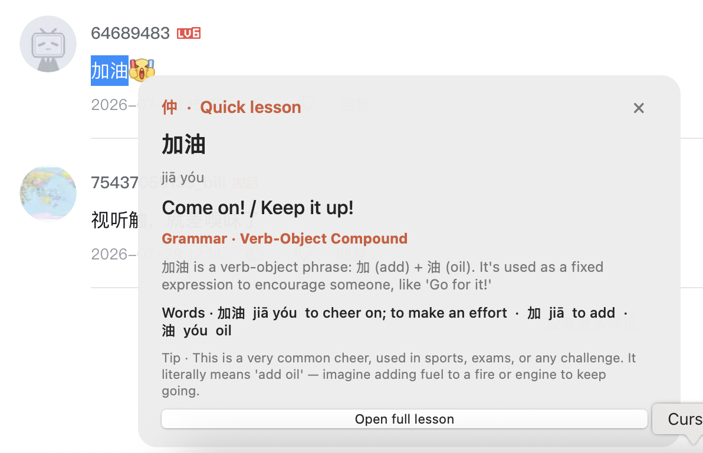
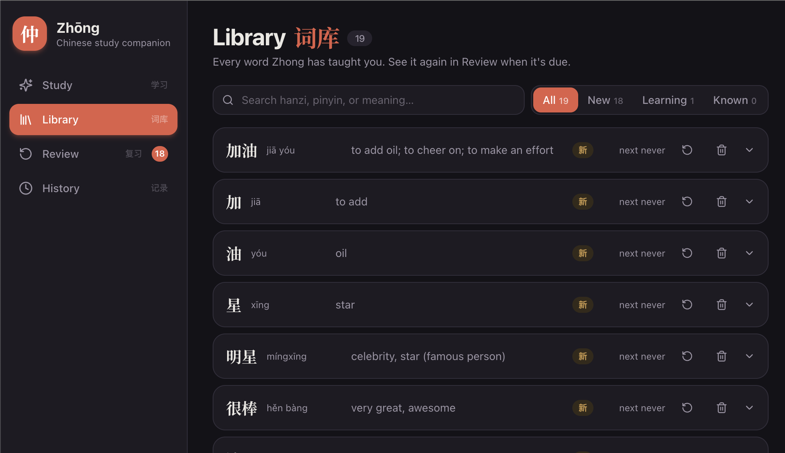

# 仲 Zhōng

Zhōng is a Chinese learning companion for macOS. Select Chinese text anywhere,
get a fast beginner-friendly explanation, and save the useful words for review.



The native picker reads selections across macOS apps, including Electron
apps. It renders the first lesson in place instead of forcing a
browser redirect.



## Product Direction

The platform roadmap lives in [`docs/plan/`](docs/plan/): vision
(`init.md`), phased roadmap (`roadmap.md`), feature list (`features.md`),
technical implementation (`implementation.md`), and the 13-month Xiamen
University prep plan (`xiamen-prep.md`). Scope is fixed to standard
Mandarin, simplified characters, and pinyin.

## Features

- Inline selection pill and teaching card for Chinese text across macOS
- Translation, pinyin, grammar, context, vocabulary, and learning tips
- Persistent SQLite vocabulary memory and study history
- Leitner-style spaced repetition review
- Dark responsive web library and review experience
- Provider-agnostic AI layer: DeepSeek, OpenAI, Ollama, Groq, and other
  OpenAI-compatible APIs
- High-quality pronunciation everywhere: tap any character or word to hear
  it (Google TTS via the cloud worker, cached at the edge)
- Native macOS Services integration
- Native menubar app with background server control

## Quick Start

The app runs on the cloud backend at https://zhong.rome.markets (Cloudflare
Worker + D1) — no local server is needed. Just open Zhōng:

```bash
zhong
```

Or visit https://zhong.rome.markets directly. Vocabulary, sessions, and
review state live in the cloud database and are shared across devices.

Local development (optional):

```bash
npm install
cp .env.example .env
# Add DEEPSEEK_API_KEY to .env
npm run dev
```

Open `http://localhost:5173` in development. Production build:

```bash
npm run build
npm start
```

Local development data is stored at `apps/server/data/zhong.db`.

## Global Command

Install the command once from this repository:

```bash
npm link
```

```text
zhong                    Open Zhōng in the browser (cloud backend)
zhong dev                Local development mode with hot reload
zhong status             Cloud and macOS integration status
zhong stop               Stop any leftover local development server
zhong restart            Reopen Zhōng in the browser
zhong build              Rebuild server and web (development)
zhong logs               Show recent runtime logs
```

## macOS Integrations

### Instant Picker

```bash
zhong install-picker
```

Grant `ZhongPicker` access under **System Settings → Privacy & Security →
Accessibility**. Then select Chinese text in Safari, Chrome, Cursor, Notes,
Word, or other apps. The `中` pill stays available until you explicitly close
it. Long lessons are scrollable and render inline.

Remove it with `zhong uninstall-picker`.

### Menubar And Startup

```bash
zhong install-startup
```

This installs the native `中` menubar app as a launchd agent. The menubar
menu opens Study, Review, and Library on the cloud backend and shows whether
it is reachable.

Use `zhong uninstall-startup` to remove the login item.

### macOS Services

```bash
zhong install-services
```

This installs `ZhongService.app` into `~/Library/Services`. In apps that expose
Services, select text and choose **Services → Teach with Zhōng**. Chrome and
some Electron apps hide that menu; use the Instant Picker instead.

## AI Providers

DeepSeek is the default:

```bash
AI_PROVIDER=deepseek
DEEPSEEK_API_KEY=sk-...
DEEPSEEK_MODEL=deepseek-chat
```

OpenAI:

```bash
AI_PROVIDER=openai
OPENAI_API_KEY=sk-...
OPENAI_MODEL=gpt-4o-mini
```

Any OpenAI-compatible endpoint:

```bash
AI_PROVIDER=openai-compatible
AI_API_KEY=...
AI_BASE_URL=http://localhost:11434/v1
AI_MODEL=llama3
```

The provider interface lives in `apps/server/src/ai/types.ts`.

## Structure

```text
apps/server/       Express API, SQLite, AI providers, SRS (local dev)
apps/cloud/        Cloudflare Worker + D1 backend, deployed at zhong.rome.markets
apps/web/          React, Vite, Tailwind, library and review UI
apps/picker/       Native macOS selection overlay
apps/menubar/      Native macOS menubar app
apps/service/      Native macOS Services host
apps/ios/          Native iOS app (App Intents based)
bin/zhong          Global macOS lifecycle CLI
.qoder/repowiki/   Project documentation (repowiki)
```

## Development Checks

```bash
npm test
npm run typecheck
npm run build
```

Runtime files and local secrets are ignored by git. The SQLite database is
only used in local development; the Mac apps connect to the cloud backend.

## Cloud deployment

`apps/cloud` is the production backend (Cloudflare Worker + D1, same API as
the local server), deployed at https://zhong.rome.markets. It also serves the
web UI: `npm run deploy:cloud` rebuilds `apps/web`, syncs `dist` into
`apps/cloud/public`, and runs `wrangler deploy`.

Secrets are never committed — set them on the worker once:

```bash
cd apps/cloud
npx wrangler secret put DEEPSEEK_API_KEY
```

Local dev secrets go in `apps/cloud/.dev.vars` (see `.dev.vars.example`).
Schema changes: add a migration file, then
`npm run db:apply:remote -w @zhong/cloud`.

## iOS App

A native SwiftUI iOS app is in `apps/ios/` providing inline text selection
teaching via iOS 18.4+ Writing Tools App Intents.

**Setup needed to continue:**
- Install Xcode 16.x (requires macOS 15+, ~3-4 GB download)
- `open apps/ios/ZhongIOS.xcodeproj`
- Sign in with free Apple ID (Xcode → Settings → Accounts)
- Build to iPhone via USB (⌘R) — no App Store needed
- Rebuild weekly to refresh the 7-day signing window

**Currently working:** App Intents, deep link handling, API client, full
lesson result view (translation, pinyin, segments, breakdown, grammar,
vocab), settings with backend URL config + health check.

**Pending:** Test build on-device, verify Writing Tools popover integration
on iOS 18.4.

**Cloud backend:** Deployed at https://zhong.rome.markets (Cloudflare Worker
+ D1, same API as the local server). Project lives in `apps/cloud`.
Set the backend URL in Settings to `https://zhong.rome.markets` and run the
health check.
